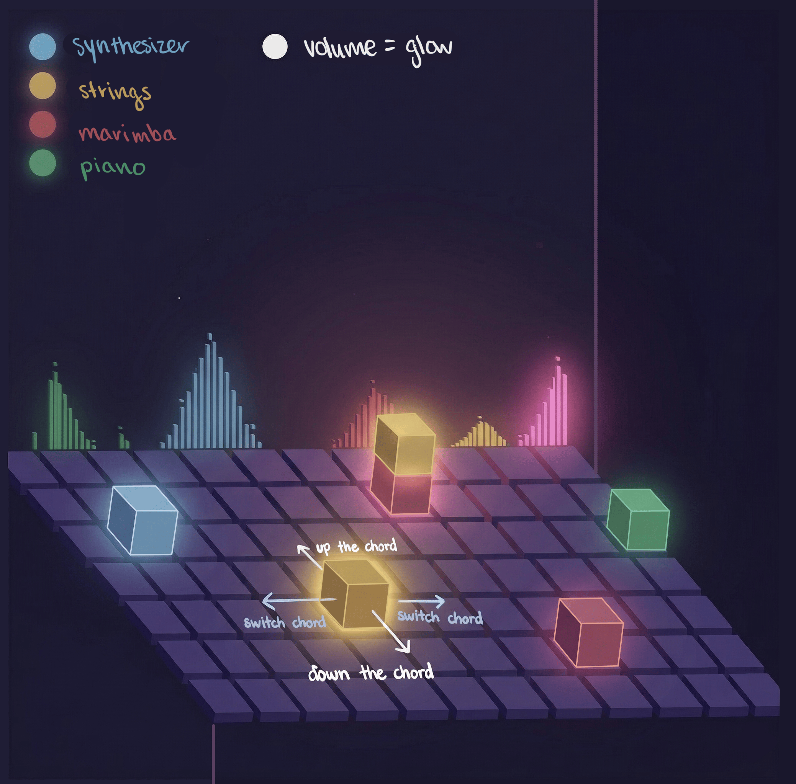

# AudioCube

A Spatial Audio Sequencer. Built with Unity and JUCE (C++)

Compose music by designing motion. AudioCube delivers audio sequencing through a visual, spatial experience, leaving behind worries of intricate music theory.

---

Most sequencers are timeline-based. This one is spatial.

Players place tiles, draw paths, then press play. The system then handles timing, movement, and playback. The goal is to make patterns easier to see and tweak in real time.

---

**How it works**

- A global BPM clock keeps everything in sync  
- Draw paths across adjacent tiles (ie. a square or a circle!)
- A cube moves along that path on beat  
- When it lands on a tile, it plays that tile’s note

Tiles store pitch data, so changing the grid OR key adapts the melody in real time. Tempo (the speed of the song) also can be maneuvered in real time!

---

- **Draw Path (Left-Click)** — Click adjacent tiles to create a sequence  
- **Play / Pause (P)** — Start or stop the clock  
- **Cancel (Left-Click)** — Clear current path  

---

- **Engine:** Unity (URP) alongside C++ (JUCE)
- **Language:** C# and C++
