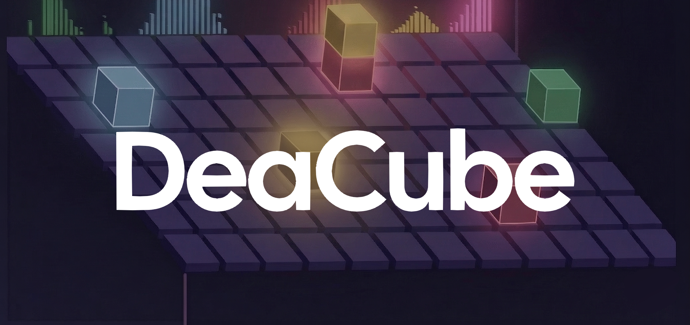
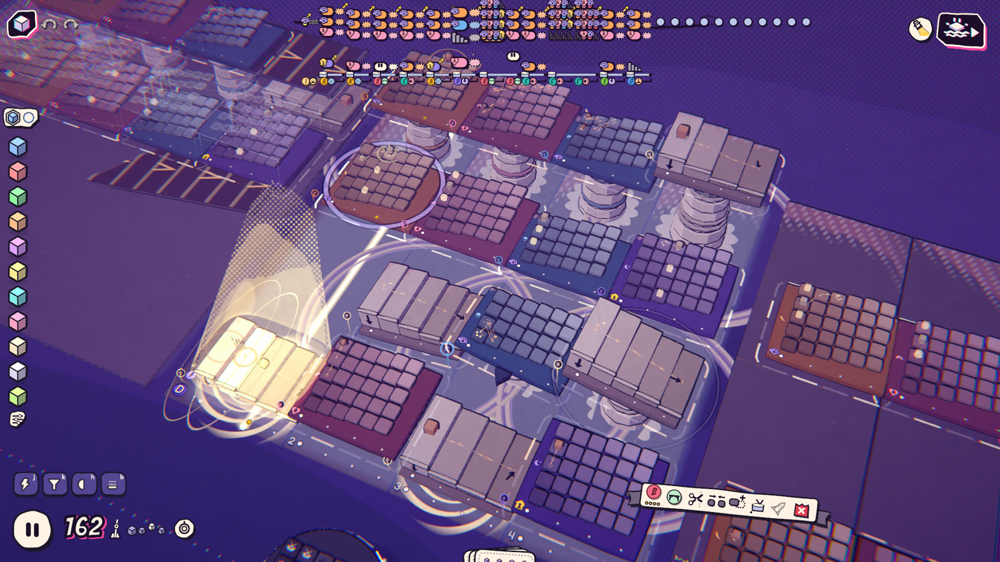
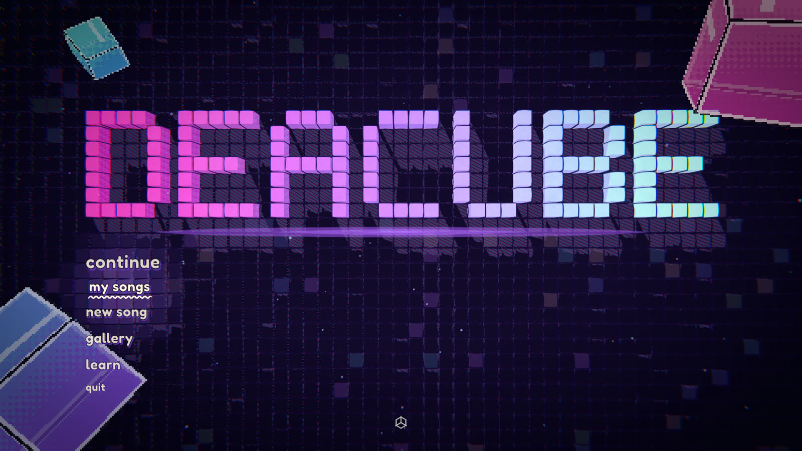
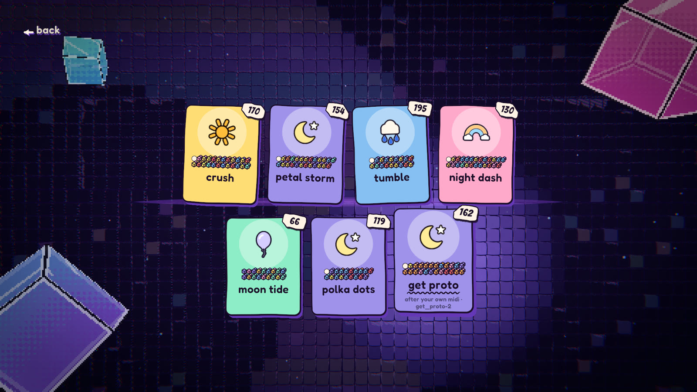
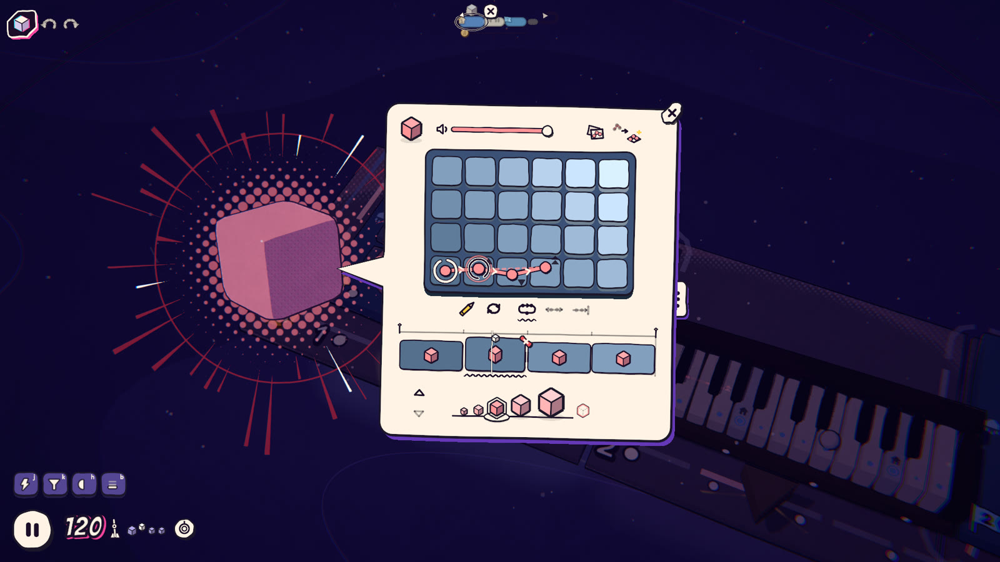
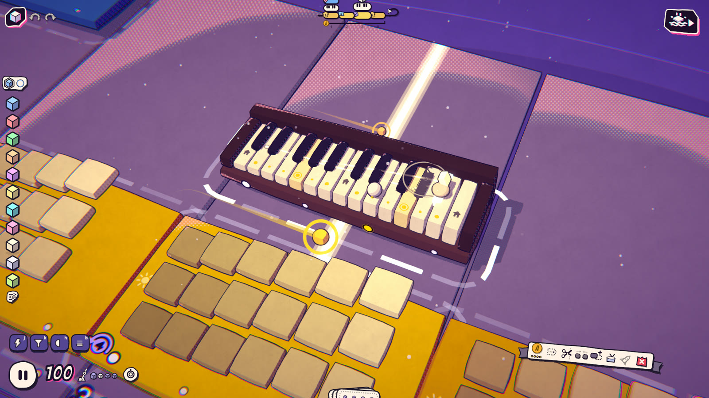
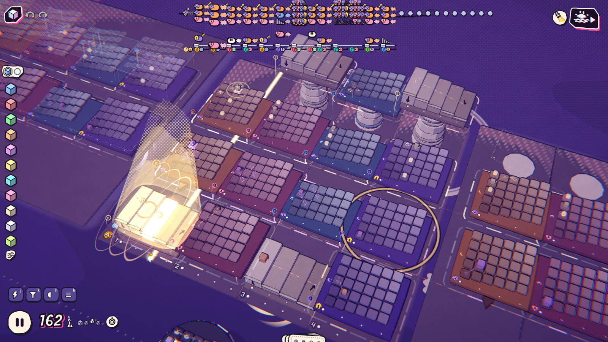
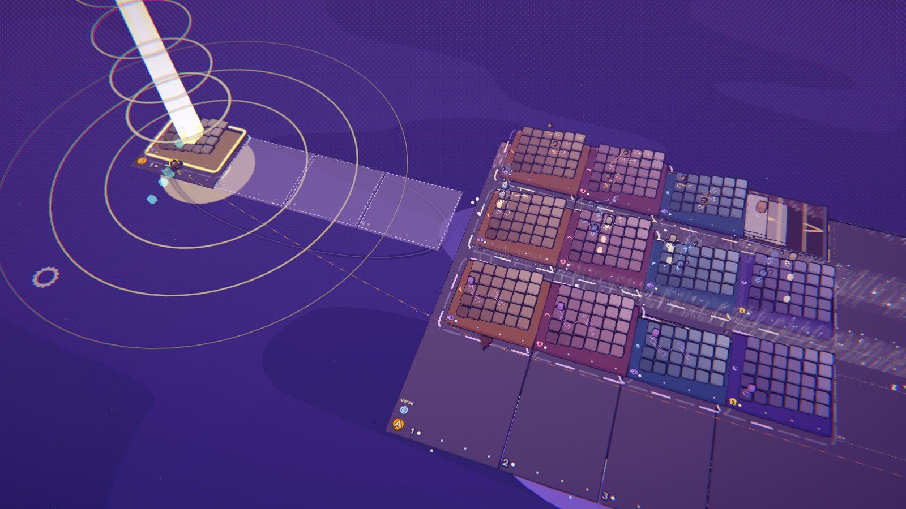
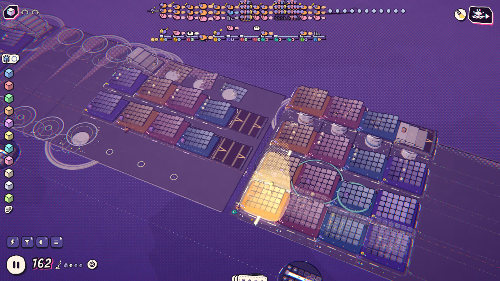

<div align="center">



**Compose music by designing motion.**

[](#installation)
[](#how-it-works)
[](#quality-checks)
[](#limitations)

</div>



## Overview

DeaCube is a spatial music toy drawn like a comic. Describe a vibe (or roll the dice) and the first chord of a progression rises out of a pastel sea as an island of tiles. Pick up a cube and trace a path across the tiles: the cube walks it and plays every tile it lands on, so a melody is a shape you drew rather than notes you knew. Every tile belongs to its island's chord, a higher tile sounds higher, and a note's length is the cube's size, so no music theory is needed.

A song reads left to right in columns. Islands stacked in a column play together, one lane per voice (bass, harmony, lead, high), and every four measures make a lettered section. Devices vary a loop the way a pianist plays one progression ten ways: a conveyor belt for repeats, rewinds, long grids, octave towers, staircases that fall into the next chord, launches that swell into the next section, echoes and harmonies. While a song plays the stage dims and the melody gets a spotlight; press P and the islands rise out of the sea as their measures arrive.

## How it works

```
┌──────────────────────────────────────────────┐
│  VIBE         a prompt or the dice → chords  │
└──────────────────────┬───────────────────────┘
                       ▼
┌──────────────────────────────────────────────┐
│  ISLANDS      each chord rises as a grid     │
└──────────────────────┬───────────────────────┘
                       ▼
┌──────────────────────────────────────────────┐
│  PATHS        a cube walks a path you trace  │
└──────────────────────┬───────────────────────┘
                       ▼
┌──────────────────────────────────────────────┐
│  ARRANGE      columns, voice lanes, sections │
└──────────────────────┬───────────────────────┘
                       ▼
┌──────────────────────────────────────────────┐
│  DEVICES      repeat, stairs, launch, echo   │
└──────────────────────┬───────────────────────┘
                       ▼
┌──────────────────────────────────────────────┐
│  PLAY         MeltySynth on the audio thread │
└──────────────────────┬───────────────────────┘
                       ▼
┌──────────────────────────────────────────────┐
│  PRESENT      islands rise from the sea      │
└──────────────────────────────────────────────┘
```

<table>
  <tr>
    <td width="50%"></td>
    <td width="50%"></td>
  </tr>
  <tr>
    <td width="50%"></td>
    <td width="50%"></td>
  </tr>
  <tr>
    <td width="50%"></td>
    <td width="50%"></td>
  </tr>
</table>

Every note goes through one decision point (`VoiceRules`) that maps a tile, its chord and its voice to a pitch, so a pattern pasted onto another grid is re-voiced for that chord: an arpeggio keeps its shape, a bass line keeps its root, a melody moves by scale steps. The synth is [MeltySynth](https://github.com/sinshu/meltysynth) rendering the GeneralUser GS SoundFont on Unity's audio thread with a sample-accurate event queue; there is no native code. The module map is in [docs/architecture.md](docs/architecture.md) and every control is in [docs/controls.md](docs/controls.md).

## The gallery

The title screen's gallery holds six demo songs that imitate songs from a Japanese Vocaloid / J-pop MIDI corpus (their progressions, tempo, groove and form; the melodies are original) and **get proto**, a full MIDI rebuilt the way a player would build it: a chord card per bar, every voice in its own lane of chord grids, a staircase on every falling measure, a launch on every crash, the hook rewinding, drum Moons with their own kit. Open one, play it, take it apart.

<p align="center"></p>

The builder that writes them is `tools/gallery/` (`build_gallery.py --verify`; `midi_grid.py` turns a MIDI file into a song using the game's own cards, lanes and devices). See [docs/deacube-gallery.md](docs/deacube-gallery.md).

## Installation

Requirements: Unity 6000.4 with URP. A [Gemini API key](https://aistudio.google.com/app/apikey) is optional and only used to turn a written vibe into a progression.

```sh
git clone https://github.com/EthanChen5291/deacube.git
cd deacube
cp AudioCube_Unity/Assets/StreamingAssets/api_config.env.example \
   AudioCube_Unity/Assets/StreamingAssets/api_config.env      # GEMINI_API_KEY=...   (optional)
```

The env file is gitignored. The instrument bank (`GeneralUser-GS.sf2`, 32 MB) ships in `StreamingAssets`, so there is nothing to build.

## Quick start

Open `AudioCube_Unity/` in Unity Hub, open `Assets/Scenes/SampleScene.unity` and press Play. Choose **learn** on the title screen for a guided first song, **new song** to describe a vibe, or **gallery** to open a finished one.

| Key | Does |
|---|---|
| Space | play / pause |
| 1–9, 0 | pick up an instrument cube |
| I | the deck of chord cards |
| P | present mode |
| ? | the shortcut sheet |

## Quality checks

The checks run inside Play mode from the editor and drive the mouse and keyboard by simulation (`Assets/DeaCube/Tests`). `V7Suites.RunAll(true, "")` runs every suite and writes `Captures/<suite>_report.txt` plus screenshots; pass suite names to run a subset.

```csharp
V7Suites.RunAll(true, "V9ChecksProto,V9ChecksLights")
```

There is no Test Runner suite.

## Limitations

- Instruments come from a General MIDI SoundFont rendered in-process: 79 of its presets in eleven groups. VST and AU plug-ins cannot be hosted inside a Unity game; a larger bank can be dropped into `StreamingAssets` and named in `SynthEngine.SoundFontFile`.
- A pressed tile plays a fixed-length note (it does not sustain while held); a keyboard spans one to five octaves.
- A column holds up to four islands, and one chord: progressions that change twice a bar move at half speed in the gallery songs.
- Chord generation via Gemini needs a live key; without one the dice builds a progression offline.
- Songs saved by earlier versions load as a single row of one-island columns.

## Repository

| Path | Contents |
|---|---|
| `AudioCube_Unity/Assets/` | Scene scripts: song, path and island managers, cubes, clock, camera, HUD |
| `AudioCube_Unity/Assets/DeaCube/` | Menu, tutorial, inspector, island headers, deck, present mode, look (toon shaders, `Ink/` kit and HUD), theory, state; `Audio/` holds SynthEngine and the vendored MeltySynth; `Tests/` holds the Play-mode checks |
| `AudioCube_Unity/Assets/Resources/Gallery/` | The gallery's seven songs and their index |
| `tools/gallery/` | The python3 builder for the gallery songs and MIDI imports |
| `docs/` | Design specs for v2 to v7, the gallery notes, [controls](docs/controls.md), [architecture](docs/architecture.md), README images in `media/` |
| `AudioCube/` | Earlier JUCE prototype of a native audio backend; not used by the Unity scene |

## Acknowledgements

[MeltySynth](https://github.com/sinshu/meltysynth) (MIT) for the SoundFont synthesizer, [GeneralUser GS](https://www.schristiancollins.com/generaluser) by S. Christian Collins for the instrument bank, [Fredoka](https://github.com/google/fonts/tree/main/ofl/fredoka) and [Bangers](https://github.com/google/fonts/tree/main/ofl/bangers) (SIL OFL) for the type, [Google Gemini](https://aistudio.google.com) for chord generation, [Tonecraft](https://experiments.withgoogle.com/tonecraft), Melatonin, Mix Universe and *Spider-Man: Into the Spider-Verse* for inspiration, and Unity for the sequencer environment.
